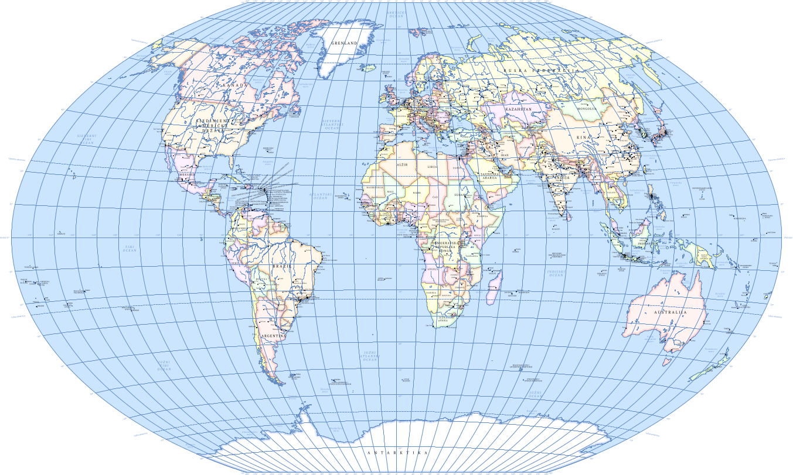

# OSMPoliticalMap
Automatically generate the World Political Map in QGIS from the OpenStreetMap planet file (see example map https://github.com/GEOF-OSGL/OSMPoliticalMap/blob/master/World_political_map_A0_Croatian.pdf) .

Set of bash and Python scripts for automatic generation of a wall world political map in small scale (e.g. 1:30 000 000 for A0 paper). The map created is being defined as a QGIS project, and all data are stored in ESRI shapefiles.

This project intents to investigate how the OpenStreetMap (OSM) planet file can be used for generating small scale "classical" maps, with the example of the World Political Map.

The main challenges are automated cartographic generalisation, as well as getting appropriate data from OSM for the desired map. The processes will be improved in order to achieve a better final result and performance. Also, inconsistencies in or missing OSM data are detected when data is being processed, which then can lead to edits in OSM.

The resulting map is a very good starting point for creating a final map, since the program automates many tasks in map creation and reduces time to get the desired final World Political Map.

User can set map projection, map scale and map language before process starts. 

# Warning
Running these scripts require downloading OSM planet file (~50GB) and filtering data from it (extra ~100GB needed). The whole process of map generation can take many hours (~6 hrs in tested environment) on a standard PC. Internet connection is needed during the data processing because list of entities with ISO-3166 code is retreived from https://raw.githubusercontent.com/datasets/country-list/master/data.csv.

# Tested environment:
Debian GNU/Linux 8 (jessie) 64-bit, 
Intel® Core™ i7-5500U CPU @ 2.40GHz × 4, 
256 GB SSD, 
16 GB RAM

# Required packages:
QGIS 2.4 or higher, 
GRASS 6.4.3 or higher, 
ogr2og2, 
GDAL/OGR library 2.1 or higher, 
Python, 
osmfilter, 
osmconvert,
nodejs,
osmtogeojson,
pyproj

# Usage:
1. Download zip of the project and extract it on partition with >150GB free space.
2. Run main script: ./_0_PoliticalMap.sh
3. Data for new map will be created in project subfolder NEW_MAP
4. When scripts finish, open QGIS project file "OSM_World_Political_Map.qgs" and do all manual edits you want (e.g. change label placement, change colours etc.). 

# Copyright and licences:
Data in ESRI Shapefiles are licensed under ODbL (http://opendatacommons.org/licenses/odbl/).

Map is licenced under CC-BY-SA (http://creativecommons.org/licenses/by-sa/4.0/legalcode).

Programs and scripts are licenced under GNU GPL (http://www.gnu.org/licenses/gpl-3.0.en.html).

The styles are licensed under CC-BY-SA (http://creativecommons.org/licenses/by-sa/4.0/legalcode).

Copyright (C) 2016, 2017 Dražen Tutić, Tomislav Jogun, Ana Kuveždić Divjak (University of Zagreb, Faculty of Geodesy, Croatia)

Send any problem or comment to dtutic@geof.hr. It will be much appreceated.

